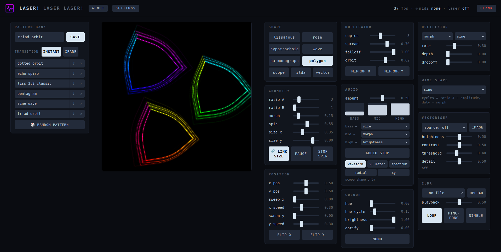

# Laser! Laser Laser!


Realtime vector visuals synthesizer for the Helios Laser DAC. Draw
lissajous figures, rose curves, hypotrochoids, waveforms, harmonographs,
polygons/stars (line → polygon → circle) and a live audio scope — or play
ILDA files and vectorise images and webcam video into laser art. Drive it
all from a browser control surface, MIDI, or the keyboard, with an
oscillator, routable audio reactivity, a pattern bank, crossfades, and
projection geometry correction.

Runs on Ubuntu, Windows and macOS. No build step; vanilla
Python + numpy, with a thin ctypes wrapper over the official Helios SDK.
Note: only tested on Ubuntu 26.06

Created using Claude.AI, but with a human in the loop requesting,orchestrating features, bugs and UX.



## ⚠️ Laser safety first
TLDR; Don't be an idiot.
Point generation bugs can park the beam. This synth only draws closed
curves (no static points), blanks on exit, and defaults to preview-only —
but *you* are the safety system. Never run at full power into an
unscanned or unknown state, keep beam paths above head height or
terminated, and test everything in `--preview` first.

## Files

- `laserx3.py` — main app (render loop, MIDI, audio, preview)
- `webui.py` + `static/index.html` — browser control surface
- `patterns.py` + `patterns.json` — pattern bank storage (a few starter
  patterns included)
- `ilda.py` + `ilda/` — ILDA (.ild) import: parser and file library
  (an animated sample is included)
- `vectorise.py` — image/webcam vectoriser (needs opencv-python-headless)
- `text.py` — single-stroke vector font for the text shape
- `settings.py` + `settings.json` — persistent settings and custom MIDI
  CC map (created on first change)
- `geometry.py` — projection geometry correction (corner-pin + pincushion)
  and the alignment test pattern
- `about.md` — free-text About page shown in the ABOUT modal (edit freely)
- `icon.png` — the app icon (also embedded as the favicon)
- `laserlaserlaser01.png` — interface snapshot shown in this README
- `shapes.py` — shape oscillator engine
- `helios.py` — ctypes wrapper for the Helios SDK
- `libHeliosDacAPI.so` — Helios SDK shared library, built for x86-64
  Linux (Ubuntu 24.04, libusb-1.0). Rebuild instructions below.
- `heliosdac.rules` — udev rule for non-root USB access

## Ubuntu setup

Recent Ubuntu (23.04+) protects the system Python (PEP 668), so `pip
install` into it fails with an `externally-managed-environment` error.
Create a virtual environment in the project folder first, then install
into that:

```bash
sudo apt install libusb-1.0-0 python3-venv python3-full

cd laser-laser-laser          # the project folder
python3 -m venv .venv
source .venv/bin/activate      # activate it (prompt shows (.venv))

pip install numpy mido python-rtmidi sounddevice pygame aiohttp
pip install opencv-python-headless   # optional: image/webcam vectoriser
```

If a source build of `python-rtmidi` or `sounddevice` complains about
missing headers, also install the build tools:

```bash
sudo apt install build-essential python3-dev libasound2-dev libportaudio2
```

Once the venv exists you don't have to activate it every time —
`.venv/bin/python laserx3.py --web` runs it directly, which is handy for
a launcher script.

```bash
# USB permissions (once):
sudo cp heliosdac.rules /etc/udev/rules.d/011_heliosdac.rules
sudo udevadm control --reload
sudo usermod -aG plugdev $USER   # then log out/in
```

Replug the DAC after installing the rule.

### Rebuilding libHeliosDacAPI.so (if the prebuilt one doesn't load)

```bash
sudo apt install libusb-1.0-0-dev g++
git clone https://github.com/Grix/helios_dac.git
cd helios_dac/sdk/cpp/shared_library
g++ -O2 -fPIC -shared -std=c++14 -o libHeliosDacAPI.so \
    HeliosDacAPI.cpp ../HeliosDac.cpp \
    ../idn/idn.cpp ../idn/idnServerList.cpp ../idn/plt-posix.cpp \
    $(pkg-config --cflags --libs libusb-1.0) -I.. -lpthread
cp libHeliosDacAPI.so /path/to/laserx3/
```

(Bonus: this build includes the SDK's IDN network-DAC support, so the
same wrapper will drive an OpenIDN adapter later if you ever want one.)

## Windows

Drop `HeliosLaserDAC.dll` and `libusb-1.0.dll` from the SDK repo
(`sdk/cpp/shared_library` and `sdk/cpp/libusb_bin`) next to the scripts.
`helios.py` picks the DLL automatically on Windows.

## macOS

Yes, it runs on macOS. The whole app is portable Python; the only
platform-specific pieces (the DAC library name and webcam access) are
handled automatically. You need a macOS build of the Helios library:

```bash
brew install libusb python@3.12
git clone https://github.com/Grix/helios_dac.git
cd helios_dac/sdk/cpp/shared_library
clang++ -O2 -fPIC -dynamiclib -std=c++14 -o libHeliosDacAPI.dylib \
    HeliosDacAPI.cpp ../HeliosDac.cpp \
    ../idn/idn.cpp ../idn/idnServerList.cpp ../idn/plt-posix.cpp \
    $(pkg-config --cflags --libs libusb-1.0) -I.. 
cp libHeliosDacAPI.dylib /path/to/laserx3/
```

`helios.py` looks for `libHeliosDacAPI.dylib` on macOS automatically. No
udev rules are needed (that's a Linux thing); the DAC just works over USB.
For the webcam vectoriser, the camera dropdown lists indices `camera 0…5`
(macOS has no stable device-name list), and the first launch prompts for
camera permission. Everything else — browser UI, MIDI, ILDA, audio — is
identical to Linux.

## Running

```bash
python3 laserx3.py --preview             # screen only — start here
python3 laserx3.py --web                 # browser UI, then open http://laserx3:8080/
python3 laserx3.py --laser --web         # laser + browser control
python3 laserx3.py --laser --preview     # laser + pygame mirror
python3 laserx3.py --list-midi           # find your controller
python3 laserx3.py --laser --midi "MPK"  # match MIDI port by substring
```

Modes combine freely (`--laser --web --preview` all at once is fine).

Options: `--points N` (default 800) and `--pps N` (default 30000).
Frame rate ≈ pps/points, so 800 pts @ 30 kpps ≈ 37 fps. Fewer points =
faster/smoother motion but coarser curves; the Helios tops out at 65 kpps
if your scanners can take it.

## Control

You drive the synth from three places at once — a browser control
surface, a MIDI controller, and the preview-window keyboard — and they
all stay in sync. The rest of this section is grouped by what you're
doing: the interfaces first, then shapes, modulation, colour, position
and geometry, the external sources (ILDA / vectoriser / text), the
pattern bank, and finally settings.

### Interfaces

**Browser UI** (`--web`, default port 8080, `--web-port` to change): a
single self-contained page — vanilla JS, no build step, no internet
needed. Laid out as visualiser + pattern bank on the left and three
columns of controls on the right, everything on screen at once at 1080p.
It collapses to fewer columns on narrow windows and stacks fully on
mobile. Live beam view with phosphor glow, shape buttons, a fader for
every parameter, bass/mid/high meters, and a BLANK button in the top
bar. The server binds to all interfaces, so a phone or tablet on the
same LAN works as a wireless control surface — `http://<machine-ip>:8080`.
State echoes to the page at 5 Hz and frames stream as compact binary over
a WebSocket at 30 Hz. No auth — it's for your LAN, not the internet.

The startup message prints `http://laserx3:8080/`. That friendly name
resolves if you set the machine's hostname to `laserx3` (`hostnamectl
set-hostname laserx3`) or add it to `/etc/hosts`; otherwise just use
`http://localhost:8080/` on the same machine, or the machine's IP from
elsewhere on the LAN.

**MIDI**: every parameter, and the pause / stop-spin / blank actions,
can be mapped to a MIDI CC or note — there's no fixed mapping to
memorise. Open **Settings → MIDI mapping**, hit LEARN on any row, and
move a knob or press a pad to bind it; bindings persist in
`settings.json`. Rotary encoders get a per-row mode (absolute / relative
/ soft-takeover) — see [Settings](#settings). Pattern recall is mapped
the same way from the pattern bank (the ♪ button). On launch the synth
auto-connects to the first real controller (never the ALSA "Midi
Through" loopback); pick a specific port in Settings → MIDI input, or
pass `--midi <substring>` for a one-off session. The activity dot in the
header and Settings lights on any incoming message and the modal shows a
running count, so "working but unmapped" and "no data at all" look
different.

**Keyboard** (preview window): `1–9` shapes, `←/→` ratio A, `↑/↓` ratio
B, `[`/`]` size, `m` morph, `s` spin, `h` hue, `a` audio amount, `d`/`D`
copies up/down, `c` mono, `f`/`g` flip X/Y, `SPACE` blank, `ESC`/`q`
quit (blanks the laser on the way out).

### Shapes

Nine generated shapes plus three external sources (ILDA, vectoriser,
text — covered under *Sources* below). The maths shapes — lissajous,
rose, hypotrochoid, wave, harmonograph, polygon and scope — share the
ratio A / ratio B / morph controls, which each shape interprets in its
own way.

**Polygon**: ratio A sets the side count — 1 draws a single line (morph
tilts it from horizontal toward vertical), 2 a line through the centre,
then 3 triangle, 4 square, 6 hexagon, up to 12. Morph rounds the
corners, all the way to a perfect circle at 1.0. Ratio B is a star skip:
2 on a 5-sided polygon draws a pentagram, 7-sided with skip 3 a
heptagram, and so on. Points are spaced by arc length, so edges scan at
even brightness.

**Wave**: draws a classic oscillator waveform across the field — sine,
triangle, saw, square or pulse, chosen in the Wave shape panel (column
3). Ratio A sets the number of cycles; morph controls amplitude (or duty
cycle, for pulse).

**Scope** (Audio panel, `scope` shape only): an audio visualiser with
five modes, selectable by button — *waveform* (classic oscilloscope
trace), *vu meter* (level bar that grows with loudness), *spectrum*
(bass/mid/high skyline from the FFT), *radial* (waveform wrapped around a
circle), and *xy* (Lissajous plot of the waveform against a delayed copy
of itself). Each falls back to a calm idle shape when no audio is
present.

### Modulation

Three ways to move parameters without touching them: the oscillator
(automatic), audio reactivity (sound-driven), and sweep (positional,
under *Position & geometry*).

**Oscillator (LFO)** (top of column 3): a low-frequency oscillator that
sweeps one parameter over time, for hands-free movement. Pick a
**target** (morph, size, hue, ratio A/B, spin, position, dup spread or
dotify) and a **wave** (sine, triangle, square, saw, or random
sample-and-hold), then set **rate**, **depth** and **dropoff**. The LFO
moves the target *around its current fader value* rather than
overwriting it, so the fader still sets the centre and the oscillator
swings around it — depth 0 switches it off. Dropoff decays the swing
across each cycle, so the movement settles toward the base value instead
of oscillating evenly. It's a normal parameter, so it's mappable and
saved in patterns — you can store a look that breathes on its own.

**Audio reactivity**: capture comes from the default input device (mic,
or a loopback/monitor source — in `pavucontrol` set the recording source
to "Monitor of …" to react to whatever's playing). Levels are adaptively
normalised, so it works without gain fiddling. Each frequency band —
bass, mid, high — has a **destination dropdown** in the Audio panel
selecting which parameter it drives. Defaults are bass→size, mid→morph,
high→brightness, but you can point any band at size, morph, brightness,
hue, spin, dup spread, dotify, X/Y position or ratio A, or *off*.
Multiple bands can target the same parameter (they add). Modulation is
additive around the current fader value, so your faders still set the
baseline, and routings are saved in patterns. **AUDIO STOP** (Audio
panel) is a master kill switch: one click freezes all band modulation
*and* drops the scope shapes to idle. The **audio amount** fader scales
the overall depth.

### Colour & beam

**Hue** (Colour panel): a strip of colour swatches sets the base hue —
click one to jump straight to that colour. Hue is still a normal 0–1
parameter under the hood, so it remains MIDI-mappable (a CC sweeps
continuously through the wheel) and is captured in patterns; the
swatches are just a faster way to pick by eye than a fader.

**Rainbow / mono**: by default a rainbow gradient spans the whole figure
(and all duplicator copies, each a different slice). The MONO toggle
(Colour panel) switches to a single colour set by the hue swatches; the
hue cycle fader still animates it, so a slow cycle gives a gently
colour-shifting single beam. Good for single-colour lasers and cleaner
looks.

**Dotify** (Colour panel): breaks the beam into dots instead of a
continuous line — 0 is solid, full is 1-in-8 points lit. Sharp dots at
the cost of brightness (fewer lit points = dimmer; nudge brightness up to
compensate). Dots sit at fixed positions along the curve, so they rotate
and morph with the shape, and combine with the duplicator.

**Duplicator**: copies (1–6) repeat the figure around a ring. MIRROR X /
MIRROR Y reflect every second copy for kaleidoscope-style symmetry — 2
copies + mirror X gives the figure and its mirror facing each other.
Spread sets the ring radius, falloff shrinks each successive copy
(echo-style; full right = all equal), orbit rotates the whole ring
(bipolar — centre is stopped). Copies are joined by blanked travel moves,
so there are no bridge lines. The point budget is shared across copies,
so more copies = fewer points each; with 6 copies of a detailed shape,
raise `--points`.

### Position & geometry

**Rotate** (Geometry panel): a static rotation offset (0–360°) added on
top of the continuous spin, for setting a figure at a fixed angle.
Switching to a source shape (text, ILDA or vector) defaults *spin* to
stopped, since those are usually meant to sit still — use rotate to
angle them.

**Size X / Y** (Geometry panel): independent X and Y scale with a 🔗 LINK
SIZE toggle. Linked (the default), the two faders move together and stay
equal; unlink to stretch a shape into an ellipse, a wide line, or any
aspect ratio. Both axes and the link state are saved in patterns; the
audio/LFO "size" destination drives the X axis (and Y too when linked).

**Position & sweep** (Position panel): X/Y position faders offset the
whole figure (0.5 = centred; parts pushed past the edge clamp at the scan
limits). Sweep auto-wanders the centre — and X and Y are **independent**,
each with its own depth and speed fader, so you can set a slow
Lissajous-style drift with different rates per axis, or sweep only one
axis. Manual position and sweep add together.

**Flip X / Flip Y** (Position panel): mirror the entire output, position
and sweep included — for projector orientation, rear projection, or
bounce mirrors. These are artistic flips that affect preview and laser
together (distinct from the hardware orientation flip below).

**Projection geometry** (Settings → Projection geometry): corrects
keystone and lens distortion on the **laser output only** — the preview
is deliberately left uncorrected so it stays a true reference. Click SHOW
TEST PATTERN to project an alignment grid (white border + grid, cyan
centre cross, red corner ticks), then drag the four corners of the editor
to match your surface — a full perspective (homography) warp, so it
handles keystone, tilt and trapezoid, not just scaling. The pincushion /
barrel slider adds a radial term for lens-style bulge (positive =
pincushion, negative = barrel). RESET GEOMETRY clears it. All of it
persists in `settings.json` and applies after the orientation flips, in
projector space.

**Projector orientation**: the DAC output mirrors X by default so the
projected image matches the preview (this also makes spin direction agree
between wall and screen). If your projector is mounted the other way,
launch with `--no-hw-flip-x`; `--hw-flip-y` is there too. This is a
hardware correction on the DAC stream only.

### Sources: ILDA, vectoriser, text

These three feed the render pipeline instead of a generated shape — and
every effect above (spin, size, position, colour, dotify, duplicator,
sweep, flips) still composes on top.

**ILDA import** (ILDA panel, column 3): plays standard `.ild` laser files
— all point formats (2D/3D, indexed and true colour, embedded palettes;
files without a palette get an approximation of the ILDA 64-colour
palette). Pick a file from the dropdown (this switches the shape to
`ilda`), drop a `.ild` onto the page, or use UPLOAD — files land in the
`ilda/` folder, so you can also just copy them there. The **playback**
slider runs animations from freeze (0) to 24 fps; LOOP / PING-PONG /
SINGLE set the traversal. File colours are used as authored (MONO
overrides them). Saved patterns remember which ILDA file they used and
restore it on load, including MIDI-triggered loads. Safety note: unlike
the synth shapes, ILDA files can contain beam dwells — the importer scans
for long runs of lit points at one coordinate and prints a warning; treat
warned files with care at full power.

**Vectoriser** (Vectoriser panel, column 3): traces the edges of images
or live webcam video and scans them as laser paths, coloured by sampling
the source — point a camera at someone and the beam draws their outline
in their own colours. Two sources: drop/upload an image, or pick a camera
from the dropdown. Pipeline: brightness/contrast → blur → Canny edge
detection → contour simplification → paths ordered to minimise beam
travel. The four filter faders shape it live: **brightness**/**contrast**
precondition the image, **threshold** sets edge sensitivity, **detail**
trades fidelity for scanability (start low for camera mode). Filter
settings are saved in patterns; the image/camera source itself isn't.
Requires `opencv-python-headless`; without it the panel just reports the
missing dependency. If the projected image flickers, lower detail, raise
threshold, or raise `--pps`.

**Text** (block under the visualiser): type a string and it's projected
as laser text in one of three single-stroke vector fonts — plain, script
(italic), or bold (outline). The fonts are Hershey-style single strokes
(no fills), so they scan efficiently. Macron vowels for te reo Māori are
supported (ā ē ī ō ū); the **ā** button adds a macron to the last vowel
typed. Selecting text switches the shape to `text`.

### Pattern bank

**Saving & loading** (left column, beside the visualiser): dial in a
look, type a name, hit SAVE (or press Enter). Click a pattern to load it
— this also puts its name in the field, so the edit workflow is load →
tweak → SAVE to overwrite. The × on each pattern deletes it (with
confirmation). Patterns capture every parameter and live in
`patterns.json` next to the scripts: plain JSON, atomic writes, safe to
hand-edit or keep in git. A few starter patterns ship with the project.

**Random pattern**: the 🎲 RANDOM PATTERN button invents a complete
pattern from all synth options except ILDA and vector (which need
external files) — random shape, ratios, colours, duplicator, oscillator
and audio routing, kept within musical ranges. It loads immediately
(respecting the transition mode); save it if you like it.

**Transitions**: the INSTANT / XFADE buttons set how pattern loads
behave. XFADE glides every parameter to the target over ~2 s with eased
motion — hue takes the short way around the wheel; discrete settings
(shape, mono, flips) switch at the midpoint. Grabbing a fader or CC
mid-fade takes that parameter out of the transition, so you always win.
Applies to browser clicks and MIDI-triggered patterns alike.

**MIDI learn**: the ♪ button on each pattern arms learn — hit a key on
your controller and that note now loads the pattern from anywhere. The
button shows the bound note (e.g. D2); click to re-learn, shift-click to
clear. Pattern bindings take priority over the built-in shape-select
notes and are stored with the pattern in `patterns.json`.

**Per-pattern PPS / points** (bottom of column 3): optional per-pattern
overrides for scan rate and point count. Leave them blank to use the
system settings; enter a value to pin it to the next pattern you save.
Stored with the pattern and restored on load, cleared automatically by
patterns that don't set them, excluded from the random generator, and
intentionally not MIDI-mapped (they're setup values, not performance
controls). Useful when one pattern needs a slower scan for a complex
figure while the rest run fast.

### Live actions

**Pause / Stop spin** (Geometry panel): PAUSE freezes every time-driven
motion — spin, sweep, orbit, hue cycling, ILDA playback and in-flight
crossfades — while faders stay live, so you can pose a frame and adjust
it. STOP SPIN zeroes the spin rate and resets the figure upright. Both,
plus **BLANK**, are mappable to MIDI buttons (they fire on the press and
ignore the release, so a momentary pad toggles cleanly).

### Settings

**Settings** (button in the header): a modal with runtime engine settings
— points per frame, scan rate (pps), crossfade time, and the
projector-orientation flips, all adjustable live without restarting —
plus projection geometry and the custom **MIDI mapping** table. Every
parameter is listed with its current binding; hit LEARN and move a
control to bind it. Custom bindings are highlighted, steal the CC from
whatever had it, and × returns a row to its default.

Each fader row also has an **encoder mode** for how its CC is
interpreted — important for rotary encoders:
- *abs* (default): value 0–127 maps straight to the range. Fine for real
  faders; with endless encoders the value jumps when you load a pattern
  and then touch the knob.
- *rel*: the encoder sends deltas, not positions — each turn nudges from
  wherever the value sits, so pattern loads never fight the knob.
  Auto-detects the two common signed encodings. Use this if your
  controller can send relative / "endless" output.
- *catch* (soft takeover): for absolute encoders that can't do relative.
  After a pattern sets a value, the knob is ignored until you turn it
  *past* that value, then it catches and tracks smoothly — no jump.
  Re-arms on every pattern load.

Everything here persists in `settings.json` — saved settings win over CLI
defaults on the next launch, so the Settings page is the durable config
and CLI flags seed the first run.

**About** (button in the header): shows the contents of `about.md`
rendered as Markdown, light grey on black — edit that file to keep your
own notes, cheat-sheets or credits with the synth.

## How it talks to the DAC

Classic Helios pipeline: `OpenDevices()` → poll `GetStatus()` until 1 →
`WriteFrame(dac, pps, flags, points, n)` with 12-bit X/Y + 8-bit RGBI
points. The DAC is double-buffered, so `write_frame()` blocking on
`GetStatus` naturally paces the render loop to the point clock — no
timers needed when the laser is running.

## Version

Current release: **1.2.0** (see `CHANGELOG.md`). Run `python laserx3.py
--version` to check the installed version.

## License

This project is released under the **MIT License** — see `LICENSE`. In
short: use it freely, including commercially, keep the copyright notice.

It depends on permissively-licensed libraries (numpy BSD, mido/rtmidi/
sounddevice MIT, aiohttp/OpenCV Apache-2.0, pygame LGPL) and bundles the
MIT-licensed Helios DAC host driver. Full details, including the LGPL
note for pygame if you make a bundled binary, are in
`THIRD_PARTY_LICENSES.md`.

**Laser safety is your responsibility.** This software drives real laser
hardware; operate it safely and within your local regulations. See the
safety notice in `LICENSE` and the warning at the top of this file.
