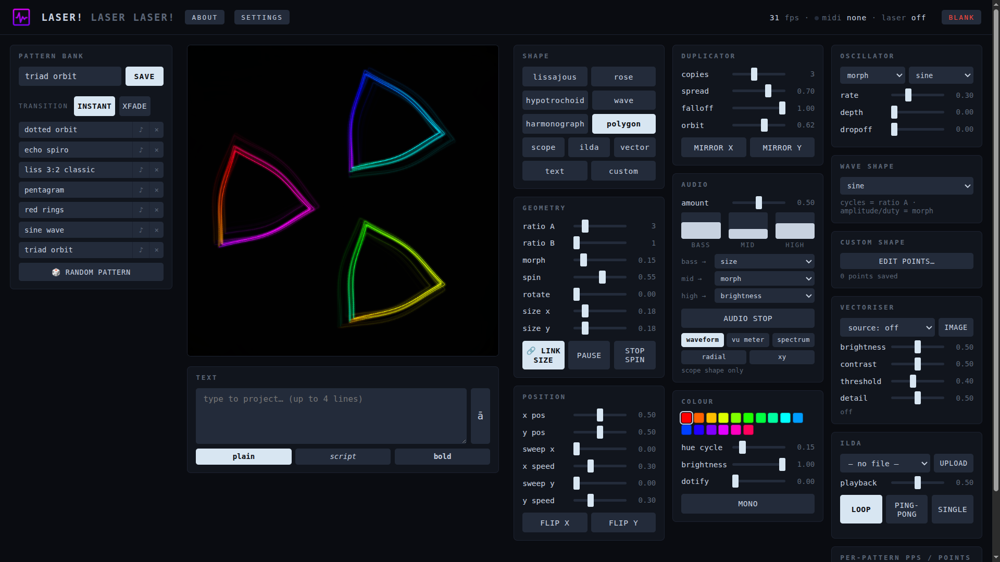

# Laser! Laser Laser!


Realtime vector visuals synthesizer for the Helios Laser DAC. 
- Lissajous figures, rose curves, hypotrochoids, waveforms, harmonographs,polygons/stars
- Text input
- Draw polygons directly and save as patterns
- Advanced 'duplicator' functionailty 
- Live audio scope (with various forms)
- Random pattern generator
- Play ILDA files
- Vectorise raster images + live webcam video > laser paths
- Custom PPS settings per pattern
- Masking - draw polygons onscreen to mask out/in
- Keystone ability
- Monitor output if you don't have a laser

Browser-based UI, MIDI mappable, oscillators, routable audio reactivity, a pattern bank, crossfades, free-from plyand projection geometry correction.


Created using Claude.AI, but with a human in the loop requesting, orchestrating features, bugs and UX.



## ⚠️ Laser safety first

TLDR; Don't be an idiot.

Point generation bugs can park the beam. This synth only draws closed
curves (no static points), and blanks on exit. Test everything in
`--preview` first. The [Mask](docs/MANUAL.md#mask) keeps the beam off chosen
areas, but it's a blanking tool for projection mapping — not a safety
interlock.

## Quick start

Don't want to set up Python? Grab a zip from the
[Releases page](https://github.com/edmonkey-nz/laser-laser-laser/releases)
— Ubuntu, Windows and macOS (Apple Silicon), no install step. See
[INSTALL.md](docs/INSTALL.md) for the details and per-platform notes.

From source:

```bash
python3 -m venv .venv && source .venv/bin/activate
pip install -r requirements.txt

python3 laserx3.py          # preview window + browser UI, no laser
python3 laserx3.py --laser  # output to the Helios DAC
```

Then open <http://localhost:8080/>. The browser UI is the main control
surface — a phone or tablet on the same LAN works too.

Driving the DAC needs the Helios shared library and (on Linux) a udev
rule — [INSTALL.md](docs/INSTALL.md) covers both.

## Documentation

- **[INSTALL.md](docs/INSTALL.md)** — prebuilt binaries, Ubuntu / Windows /
  macOS setup, building the Helios library, command-line options
- **[MANUAL.md](docs/MANUAL.md)** — every control explained: shapes,
  modulation, colour, geometry, the mask, ILDA / vectoriser / text,
  the pattern bank, MIDI mapping and settings
- **[CHANGELOG.md](CHANGELOG.md)** — what changed, per release
- **[CONTRIBUTING.md](CONTRIBUTING.md)** — ground rules if you want to
  hack on it

## Version

Current release: **1.4.0** (see `CHANGELOG.md`). Run `python laserx3.py
--version` to check the installed version.

## License

This project is released under the **MIT License** — see `LICENSE`. In
short: use it freely, including commercially, keep the copyright notice.
